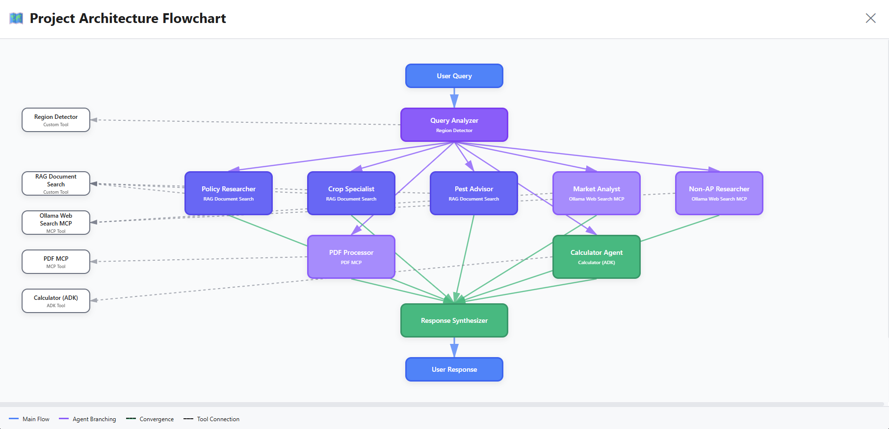
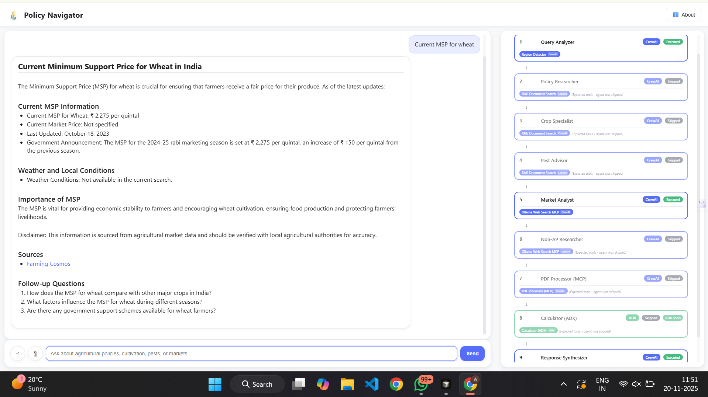

# Policy Navigator - Multi-Agent System

A comprehensive multi-agent system built with CrewAI for navigating agricultural policies, crop cultivation guidance, pest management, and real-time market information for farmers in Andhra Pradesh.

## Features

- **9 Specialized AI Agents** working collaboratively (8 CrewAI + 1 ADK)
- **MCP Integration**: Ollama Web Search MCP (web search) and PDF MCP (document processing)
- **Custom Tools**: RAG (ChromaDB), Region Detector
- **Structured Outputs**: Pydantic models for all agent responses
- **Context Sharing**: Agents share intermediate outputs via CrewAI memory
- **A2A Communication**: ADK integration for calculator agent
- **Monitoring & Logging**: Comprehensive callbacks for tracking execution

## System Architecture

The following diagram shows the complete project architecture and agent flow:



## Complete System Workflow Diagram

The following diagram illustrates the complete workflow from user input to final response:

```
┌─────────────────────────────────────────────────────────────────────────────┐
│                           USER QUERY INPUT                                   │
│                    (Text Query + Optional PDF File)                         │
└───────────────────────────────┬─────────────────────────────────────────────┘
                                │
                                ▼
┌─────────────────────────────────────────────────────────────────────────────┐
│                        MAIN ORCHESTRATOR                                     │
│  - Initializes CrewAI Crew                                                  │
│  - Manages Workflow Execution                                               │
│  - Handles PDF Upload Processing                                            │
└───────────────────────────────┬─────────────────────────────────────────────┘
                                │
                                ▼
┌─────────────────────────────────────────────────────────────────────────────┐
│                    POLICY NAVIGATOR CREW                                     │
│                    (CrewAI Framework)                                        │
│  - Agent Coordination                                                        │
│  - Task Orchestration                                                        │
│  - Memory Management                                                         │
└───────────────────────────────┬─────────────────────────────────────────────┘
                                │
                                ▼
┌─────────────────────────────────────────────────────────────────────────────┐
│                    QUERY ANALYZER AGENT                                     │
│                    (Always Executes First)                                   │
│                                                                               │
│  STEP 1: Scope Validation                                                    │
│    ├─ Agricultural? → Continue                                               │
│    └─ Out of Scope? → Route to Synthesizer Only                             │
│                                                                               │
│  STEP 2: Region Detection (Region Detector Tool)                             │
│    ├─ AP Region → Use RAG                                                   │
│    ├─ Non-AP Region → Use Web Search                                         │
│    └─ Mixed → Use Web Search                                                  │
│                                                                               │
│  STEP 3: Query Classification                                               │
│    ├─ Policy / Cultivation / Pest / Market / General                         │
│    └─ Document Upload (if PDF provided)                                       │
│                                                                               │
│  STEP 4: Entity Extraction                                                    │
│    └─ Crops, Schemes, Locations, Pests                                      │
│                                                                               │
│  STEP 5: Agent Assignment                                                    │
│    └─ Generates required_agents list                                         │
│                                                                               │
│  OUTPUT: QueryAnalysis (Pydantic Model)                                      │
└───────────────────────────────┬─────────────────────────────────────────────┘
                                │
                                ▼
                    ┌───────────────────────┐
                    │  Execution Tracker    │
                    │  (Stores Query Analysis)│
                    └───────────┬───────────┘
                                │
        ┌───────────────────────┴───────────────────────┐
        │                                               │
        ▼                                               ▼
┌───────────────────────┐                  ┌───────────────────────┐
│  CONDITIONAL TASK     │                  │  CONDITIONAL TASK     │
│  EXECUTION            │                  │  EXECUTION            │
│  (Based on            │                  │  (Based on            │
│   required_agents)    │                  │   required_agents)    │
└───────┬───────────────┘                  └───────┬───────────────┘
        │                                           │
        │                                           │
┌───────┴───────┐                      ┌──────────┴──────────┐
│               │                      │                      │
▼               ▼                      ▼                      ▼
┌───────────────┐ ┌───────────────┐ ┌───────────────┐ ┌───────────────┐
│   POLICY      │ │    CROP       │ │    PEST       │ │    MARKET     │
│  RESEARCHER   │ │  SPECIALIST   │ │   ADVISOR     │ │   ANALYST     │
│               │ │               │ │               │ │               │
│  Tool: RAG    │ │  Tool: RAG    │ │  Tool: RAG    │ │  Tool: Ollama │
│  (ChromaDB)   │ │  (ChromaDB)   │ │  (ChromaDB)   │ │  Web Search   │
│               │ │               │ │               │ │  MCP          │
│  Output:      │ │  Output:      │ │  Output:      │ │  Output:      │
│  PolicyResp   │ │  CropGuidance │ │  PestMgmt     │ │  MarketInfo   │
└───────┬───────┘ └───────┬───────┘ └───────┬───────┘ └───────┬───────┘
        │                  │                  │                  │
        └──────────────────┴──────────────────┴──────────────────┘
                                │
        ┌───────────────────────┴───────────────────────┐
        │                                               │
        ▼                                               ▼
┌───────────────┐                          ┌───────────────┐
│   NON-AP     │                          │     PDF       │
│  RESEARCHER  │                          │   PROCESSOR   │
│              │                          │               │
│  Tool: Ollama│                          │  Tool: PDF    │
│  Web Search  │                          │  MCP Server   │
│  MCP         │                          │               │
│              │                          │  Output:      │
│  Output:     │                          │  PDFAnalysis  │
│  WebSearchResp│                         │               │
└───────┬───────┘                          └───────┬───────┘
        │                                           │
        └───────────────────┬───────────────────────┘
                            │
                            ▼
                ┌───────────────────────┐
                │   CALCULATOR AGENT    │
                │      (ADK)            │
                │                       │
                │  Tool: Google         │
                │  Generative AI        │
                │                       │
                │  A2A Communication:   │
                │  StateManager        │
                │                       │
                │  Output: Calculation  │
                │  Results              │
                └───────────┬───────────┘
                            │
                            ▼
                ┌───────────────────────┐
                │  Execution Tracker    │
                │  (Aggregates All)     │
                │                       │
                │  - Executed Agents    │
                │  - Used Tools         │
                │  - Agent-Tool Mapping │
                └───────────┬───────────┘
                            │
                            ▼
                ┌───────────────────────┐
                │  RESPONSE SYNTHESIZER │
                │                       │
                │  - Combines outputs   │
                │  - Formats markdown   │
                │  - Adds citations     │
                │  - Validates content  │
                │                       │
                │  Output: FinalResponse│
                └───────────┬───────────┘
                            │
                            ▼
                ┌───────────────────────┐
                │   FINAL RESPONSE      │
                │                       │
                │  - response_text      │
                │  - response_markdown  │
                │  - sources            │
                │  - confidence_score   │
                │  - workflow_details   │
                └───────────────────────┘

┌─────────────────────────────────────────────────────────────────────────────┐
│                        INFRASTRUCTURE LAYER                                   │
├──────────────────────┬──────────────────────┬─────────────────────────────────┤
│                      │                      │                                 │
│   CHROMADB           │    MCP SERVERS       │    MONITORING                   │
│   VECTOR STORE       │                      │    CALLBACKS                    │
│                      │                      │                                 │
│  - Document Storage  │  - Ollama Web Search │  - step_callback                │
│  - Embedding Search  │  - PDF Extraction    │  - task_callback                │
│  - Metadata Filter   │  - FastMCP Protocol  │  - Execution Tracking           │
│                      │                      │  - Tool Usage Logging           │
│                      │                      │                                 │
│  Used by:            │  Used by:            │  Tracks:                        │
│  - Policy Researcher │  - Market Analyst    │  - All Agents                   │
│  - Crop Specialist   │  - Non-AP Researcher │  - All Tools                    │
│  - Pest Advisor      │  - PDF Processor     │  - Execution Flow              │
│                      │                      │                                 │
└──────────────────────┴──────────────────────┴─────────────────────────────────┘
         │                      │                      │
         │                      │                      │
         └──────────────────────┴──────────────────────┘
                                │
                    (Connected to agents above)
```

## Detailed Workflow Steps

1. **User Input**: User submits query (text + optional PDF)
2. **Orchestration**: MainOrchestrator initializes CrewAI crew
3. **Query Analysis**: Query Analyzer performs scope validation, region detection, classification, entity extraction, and agent assignment
4. **Conditional Execution**: Specialized agents execute only if in required_agents list
5. **Tool Usage**: Agents use appropriate tools (RAG, MCP, ADK) based on query type
6. **A2A Communication**: ADK agents communicate via StateManager
7. **Execution Tracking**: All agents and tools tracked by ExecutionTracker
8. **Response Synthesis**: Synthesizer combines all outputs into final response
9. **Output**: Structured response with markdown, sources, and workflow details

## Project Structure

The project is organized into the following directories:

- **src/policy_navigator/** - Main source code
  - **crew.py** - Main crew orchestration using CrewAI @CrewBase pattern
  - **main.py** - Entry point for command-line interface
  - **config/** - YAML configuration files for agents and tasks
  - **tools/** - Custom CrewAI tools (RAG, Region Detector, Ollama Web Search)
  - **models/** - Pydantic schemas for structured outputs
  - **callbacks/** - Monitoring and execution tracking callbacks
  - **retrieval/** - RAG infrastructure (ChromaDB vector store, document processor)
  - **adk/** - ADK integration (Agent Development Kit adapter)
  - **core/** - Core orchestration logic
  - **guardrails/** - Hallucination guardrails and validation

- **mcp_servers/** - MCP server implementations
  - **ollama_websearch_mcp_server.py** - Ollama Web Search MCP server
  - **pdf_extractor_mcp_server.py** - FastMCP PDF extractor (pypdf)
  - **pdf_mcp_server.py** - Legacy PDF MCP server (PyPDF2)

- **data/** - Document repository containing agricultural policy documents, crop guides, and related materials organized by category

- **web/** - Web interface
  - **api/** - Flask REST API backend
  - **react-ui/** - React frontend application
  - **static/** - Static files for simple HTML interface

- **scripts/** - Utility scripts
  - **initialize_rag.py** - Script to initialize RAG database with documents
  - **run_pdf_mcp_server.py** - Script to run PDF MCP server standalone

- **chroma_db/** - ChromaDB vector database (created after RAG initialization)

## Installation

### Prerequisites

- Python 3.10 or higher (tested with Python 3.12.4)
- Virtual environment (recommended)

### Setup Steps

1. **Create virtual environment:**
   - Create a new virtual environment using `python -m venv venv`
   - Activate the virtual environment:
     - On Windows: `venv\Scripts\activate`
     - On macOS/Linux: `source venv/bin/activate`

2. **Install dependencies:**
   - Install all dependencies from `pyproject.toml` using: `pip install -e .`
   - This will install all required packages including CrewAI, ChromaDB, and MCP libraries

3. **Configure environment variables:**
   - Create a `.env` file in the project root directory
   - Add your API keys and configuration (see Environment Variables section below)

4. **Initialize RAG database:**
   - Run the initialization script: `python scripts/initialize_rag.py`
   - This processes documents from the `data/` directory and creates the vector database

## Environment Variables

### Required Environment Variables

At least one LLM provider API key is required:
- `OPENAI_API_KEY` - OpenAI API key for GPT models
- `GROQ_API_KEY` - Groq API key for Llama models

ADK agent API key (required for calculator agent):
- `GOOGLE_API_KEY` - Google Generative AI API key
- `GEMINI_API_KEY` - Alternative to GOOGLE_API_KEY (both work)

Ollama Web Search MCP (required for market and non-AP research agents):
- `OLLAMA_API_KEY` - Ollama API key for web search capabilities

### Optional but Recommended Environment Variables

LLM Configuration:
- `PRIMARY_LLM_PROVIDER` - Primary LLM provider: "openai" or "groq"
- `PRIMARY_LLM_MODEL` - Primary model name (e.g., "groq/llama-3.3-70b-versatile", "gpt-4o-mini")
- `FALLBACK_LLM_PROVIDER` - Fallback provider if primary fails
- `FALLBACK_LLM_MODEL` - Fallback model name

Embedding and Model Configuration:
- `EMBEDDING_MODEL` - Embedding model for RAG (default: "sentence-transformers/all-MiniLM-L6-v2")
- `ADK_MODEL` - Google Generative AI model for ADK agent (default: "gemini-pro")

PDF Processing:
- `USE_FASTMCP_PDF` - Enable FastMCP PDF extractor: "1" or "0" (default: "0" uses PyPDF2)

### Unused/Reserved Variables

These variables are not currently used but may be reserved for future features:
- `BRAVE_API_KEY` - Reserved for future Brave search integration
- `GOOGLE_CLOUD_PROJECT_ID` - Not needed (only for Vertex AI, not used)
- `GOOGLE_API_KEY_UNAUTHORIZED` - Typo, use `GOOGLE_API_KEY` instead
- `LANGCHAIN_*` - Reserved for future LangChain integration

## Usage

### Command Line Interface

Run the main script from the project root:
- `python src/policy_navigator/main.py`

This starts an interactive command-line interface where you can:
- Enter queries about agricultural policies, crop cultivation, pest management, or market information
- Upload PDF documents for analysis
- Get structured responses from the multi-agent system

### Web Interface



Start the Flask API server:
- Navigate to `web/api/` directory
- Run `python app.py` or use Flask's development server
- Access the React frontend at the configured port (typically http://localhost:5000)

The web interface provides:
- Interactive chat interface
- PDF upload functionality
- Real-time agent execution tracking
- System status monitoring
- Project mind map visualization

## MCP Integration

This project uses **Model Context Protocol (MCP)** servers for external tool integration:

### MCP Servers Configured

1. **Ollama Web Search MCP Server**
   - **Purpose**: Web search for real-time information
   - **Used by**: Market Analyst and Non-AP Researcher agents
   - **Tools**: `web_search` (for searching) and `web_fetch` (for fetching specific URLs)
   - **Configuration**: Requires `OLLAMA_API_KEY` environment variable
   - **Setup**: Sign up at https://ollama.com/ and add your API key to `.env`
   - **Note**: Ollama offers a free tier for web searches

2. **PDF MCP Server**
   - **Purpose**: PDF text extraction and document processing
   - **Used by**: PDF Processor Agent
   - **Implementation**: Two implementations available:
     - FastMCP PDF Extractor (pypdf) - Set `USE_FASTMCP_PDF=1`
     - Legacy PDF MCP Server (PyPDF2) - Default when `USE_FASTMCP_PDF=0`
   - **Features**: Page-by-page text extraction, markdown formatting, error handling

### MCP Benefits

- **Standardized Protocol**: MCP provides a standardized way to integrate external services
- **Automatic Discovery**: Tools are automatically discovered and integrated
- **Error Resilience**: Graceful handling of unavailable servers
- **Performance**: On-demand connections with schema caching

## System Workflow

The system follows a multi-stage workflow:

1. **User Query Input** - User submits a query through CLI or web interface

2. **Query Analyzer Agent** - First agent analyzes the query:
   - Uses Region Detector Tool to identify AP vs non-AP regions
   - Classifies query type (policy, cultivation, pest, market, document_upload)
   - Extracts entities (crops, schemes, locations, pests)
   - Determines which specialized agents should handle the request

3. **Conditional Task Routing** - System routes to appropriate agents based on analysis:
   - **RAG-Based Agents** (for AP queries): Policy Researcher, Crop Specialist, Pest Advisor
   - **MCP-Based Agents** (for real-time data): Market Analyst, Non-AP Researcher, PDF Processor
   - **ADK-Based Agent** (for calculations): Calculator Agent

4. **Specialized Agent Execution** - Selected agents execute their tasks:
   - RAG agents search local document database
   - MCP agents use web search or PDF processing
   - ADK agent performs calculations

5. **Response Synthesizer Agent** - Final agent synthesizes all outputs:
   - Aggregates context from all executed agents
   - Generates comprehensive markdown response
   - Distinguishes between local database data and web-searched data
   - Compiles sources and generates follow-up questions

6. **Structured Output** - Returns Pydantic model with:
   - Response text and markdown formatting
   - Sources and citations
   - Follow-up questions

## Agents

The system consists of **9 specialized agents**, each with distinct roles and capabilities:

### 1. Query Analyzer (CrewAI)
- **Role**: Query Understanding Specialist
- **Tools**: Region Detector Tool
- **Responsibilities**: Analyzes user queries, detects regions, classifies query type, extracts entities, determines agent routing
- **Output**: QueryAnalysis (Pydantic model) with required_agents list

### 2. Policy Researcher (CrewAI)
- **Role**: Agricultural Policy Expert
- **Tools**: RAG Document Search Tool
- **Responsibilities**: Retrieves agricultural schemes and policies, explains eligibility and benefits, provides PM-KISAN and PMFBY information
- **Output**: PolicyResponse (Pydantic model)

### 3. Crop Specialist (CrewAI)
- **Role**: Crop Cultivation Expert
- **Tools**: RAG Document Search Tool
- **Responsibilities**: Provides crop cultivation guidance, recommends varieties, provides sowing details, fertilizer schedules, irrigation schedules, economics
- **Output**: CropGuidance (Pydantic model)

### 4. Pest Advisor (CrewAI)
- **Role**: Pest Control Advisor
- **Tools**: RAG Document Search Tool
- **Responsibilities**: Identifies pests and diseases, provides IPM strategies, recommends control measures, advises on ETL and safe periods
- **Output**: PestManagement (Pydantic model)

### 5. Market Analyst (CrewAI)
- **Role**: Market & Weather Analyst
- **Tools**: Ollama Web Search MCP
- **Responsibilities**: Provides current MSP, fetches real-time market prices, provides weather conditions and forecasts, shares government announcements
- **Output**: MarketInfo (Pydantic model)

### 6. Non-AP Researcher (CrewAI)
- **Role**: Non-AP Region Web Research Specialist
- **Tools**: Ollama Web Search MCP
- **Responsibilities**: Searches web for agricultural information about non-AP regions, handles queries for other states, provides well-sourced information
- **Output**: WebSearchResponse (Pydantic model)

### 7. PDF Processor Agent (CrewAI)
- **Role**: PDF Document Processor
- **Tools**: PDF MCP Tool
- **Responsibilities**: Extracts text from uploaded PDFs, analyzes document content, generates summaries, validates domain, integrates with RAG system
- **Output**: PDFAnalysis (Pydantic model)

### 8. Response Synthesizer (CrewAI)
- **Role**: Response Synthesizer
- **Tools**: None (synthesizes from other agents)
- **Responsibilities**: Synthesizes comprehensive responses, creates markdown formatting, distinguishes data sources, compiles sources, handles out-of-scope queries
- **Output**: FinalResponse (Pydantic model)

### 9. Calculator Agent (ADK)
- **Role**: Agricultural Calculator
- **Framework**: Google ADK (Agent Development Kit)
- **Responsibilities**: Performs agricultural calculations using Google Generative AI, calculates cost of cultivation, yield, subsidy amounts, profit
- **Communication**: A2A Protocol via ADKAgentAdapter

## Tools

The system uses a combination of custom CrewAI tools, MCP tools, and ADK capabilities:

### CrewAI Custom Tools

#### RAG Document Search Tool
- **Purpose**: Semantic search through agricultural policy and crop information documents
- **Technology**: ChromaDB vector store with SentenceTransformer embeddings
- **Features**: Searches through documents across multiple categories, returns top relevant chunks with scores, supports category filtering
- **Used by**: Policy Researcher, Crop Specialist, Pest Advisor

#### Region Detector Tool
- **Purpose**: Detects if query mentions Andhra Pradesh or other regions
- **Technology**: Rule-based pattern matching with comprehensive region databases
- **Features**: Detects AP districts, cities, non-AP states and cities, returns structured JSON with region type
- **Used by**: Query Analyzer

### MCP Tools

#### Ollama Web Search MCP
- **Purpose**: Web search for real-time information
- **Technology**: Ollama API via Model Context Protocol
- **Features**: Provides current market prices, MSP, weather information, returns source URLs and timestamps
- **Used by**: Market Analyst, Non-AP Researcher
- **Configuration**: Requires `OLLAMA_API_KEY` environment variable

#### PDF MCP Tool
- **Purpose**: PDF text extraction and document processing
- **Technology**: PyPDF2/pypdf via MCP protocol
- **Features**: Extracts text page-by-page, supports both PyPDF2 and FastMCP implementations, provides formatted markdown
- **Used by**: PDF Processor Agent

### ADK Capabilities

#### Calculator Capabilities (via ADK Agent)
- **Purpose**: Agricultural financial calculations
- **Technology**: Google Generative AI (Gemini) via ADK
- **Capabilities**: Cost estimation, yield calculation, subsidy calculation, profit calculation
- **Communication**: A2A Protocol via StateManager
- **Used by**: Calculator Agent (ADK)

## A2A (Agent-to-Agent) Protocol Integration

This project implements A2A Protocol concepts for interoperability between CrewAI and Google ADK agents.

### Implementation Approach

The system uses an **adapter pattern** for local ADK agents:
- **ADKAgentAdapter**: Wraps Google ADK agents to work seamlessly with CrewAI agents
- **StateManager**: Acts as the A2A communication channel
- **A2AMessage**: Enhanced message format aligned with A2A Protocol standards
- **Task Delegation**: CrewAI agents can delegate tasks to ADK agents automatically

### A2A Protocol Features

1. **Task Delegation**: CrewAI agents delegate specialized tasks (calculations) to ADK agents with automatic routing
2. **Message Exchange**: Standardized message format with conversation tracking, status updates, and capability discovery
3. **Capability Discovery**: Agents expose capabilities enabling intelligent task routing
4. **Status Tracking**: Real-time status updates, error handling, and conversation history

### Architecture

The A2A communication flow:
- CrewAI Agent delegates task to ADKAgentAdapter
- ADKAgentAdapter communicates with ADK Agent (Google Gemini) via StateManager
- A2AMessage Exchange follows protocol-compliant format
- Results flow back through the adapter to CrewAI agent

### Why Adapter Pattern?

- **Local Agents**: Google ADK agents run locally (not as remote endpoints)
- **Simplicity**: No HTTP server setup required
- **Performance**: Direct in-process communication
- **Compliance**: Meets A2A Protocol requirements for interoperability

## Requirements Compliance

✅ **Context Sharing** - Via CrewAI memory and task context  
✅ **Tool Integration (MCP)** - Ollama Web Search MCP and PDF MCP implemented  
✅ **Structured Output** - Using Pydantic models for all agent responses  
✅ **Task Monitoring & Logging** - Comprehensive callbacks for tracking execution  
✅ **A2A Communication** - Via ADK integration with A2A Protocol alignment  
✅ **CrewAI/ADK Framework** - Primary CrewAI with ADK for calculator agent  

## License

MIT
